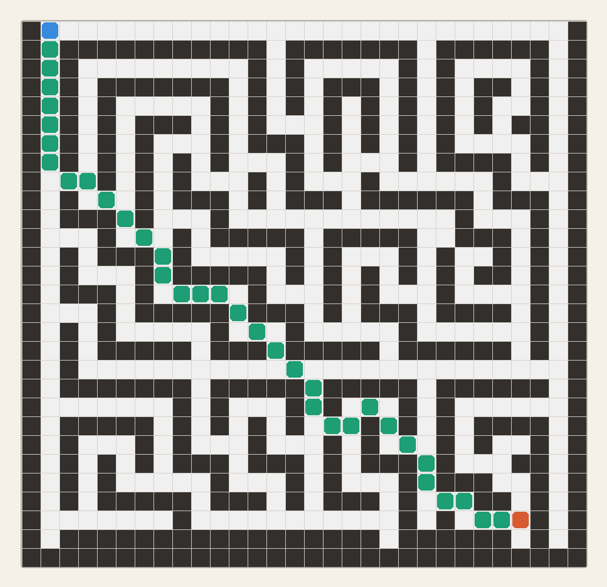

# Getting Started

## Pip Installation

To Install Seally with Pip, run the following command:
```
pip install seally
```

## Project Installation
When using Seally in a Python project we recommend using a modern Python package manager such as **uv** or **pixi**.

- uv: A modern Python package manager designed for speed and simplicity
    - Ensure [uv](https://docs.astral.sh/uv/guides/install-python/) is installed and initilized in your project.
    - cd into the projects directory and run the following command: 
    ```
    uv add seally
    ``` 

## Importing Seally
After completeing the installation, Seally can be imported into a Python file:
``` python
import Seally as sly
```

For more information on the Seally Library and its features visit the [Reference](reference.md) page.

## Example
Let's try using some of Seally's core functionality to get a better idea of how the library works.

In this example we will:

- Load an enviroment from a file.
- Perform A\* search on the loaded enviroment to find the shortest path between two points.
- Visualize the path using the Seally visualization tools.
---
1. **Add Necessary Imports**: 
First, let's import the components of Seally that we will need to create an environment, generate a path, and visualize our path.
    ```python
    from seally.env.grid_map import GridMap, GridCell
    from seally.planners.a_star import AStar
    from seally.common.heuristics import chebyshev_distance
    from seally.viz.vizualizer import Visualizer2D
    ```

2. **Load an enviroment from a file**: 
To perform planning we first need an environment and a discretization of that environment. In this example, we are going to use the A\* algorithm. A\* is well suited for grid environments and in Seally, A\* works on GridMap environments.
    ```python
    # Create an enviroment from a map file
    env: GridMap = GridMap(gen_random=False, file_path='./maps/map7.csv', move_4d=False)
    ```

3. **Defining a Planner**: 
Next, we need to define a planner that we can use to find a path between points in the environment. The A\* planner accepts two arguments. The first is the GridMap environment we generated and the second is the heuristic used to determine the "cost to go". In Seally, GridMaps allow for 8-directional movement and thus agents can move along diagonals. For that reason, we chose the Chebyshev Distance as our heuristic.
    ```python
    # Create a planner and pass in the heuristic
    a_star = AStar(env=env, heuristic=chebyshev_distance)
    ```

4. **Generate a Path between two positions**: 
Finally, we can generate a path by defining a start and goal position in the environment. Then we run the A\* algorithm on these positions. A\* returns a Path which is a Tuple of GridCells.
    ```python
    # Define the source and goal positions
    source = GridCell((1, 0))
    goal = GridCell((26, 26))

    # Find the shortest path from the start to the goal
    path = a_star.compute_path(source, goal)
    ```

5. **Visualize the Path**: 
We can visual enviroments and paths using Seally's visualization tools.
    ```python
    # Visualize the path
    viz = Visualizer2D()
    viz.run_visualization(path, env)
    ```
    

**Full Example:**
```python
from seally.env.grid_map import GridMap, GridCell
from seally.planners.a_star import AStar
from seally.common.heuristics import chebyshev_distance
from seally.viz.vizualizer import Visualizer2D

def main():
    # Create an enviroment from a map file
    env: GridMap = GridMap(gen_random=False, file_path='./maps/map7.csv', move_4d=False)

    # Create a planner and pass in the heuristic
    a_star = AStar(env=env, heuristic=chebyshev_distance)

    # Define the source and goal positions
    source = GridCell((1, 0))
    goal = GridCell((26, 26))

    # Find the shortest path from the start to the goal
    path = a_star.compute_path(source, goal)

    # Visualize the path
    viz = Visualizer2D()
    viz.run_visualization(path, env)


if __name__ == "__main__":
    main()
```


